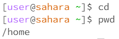

 \
For using the cd command without any arguments, nothing is printed and nothing changes in the terminal. That is because this the cd command is meant to change directory and no directory is listed.
