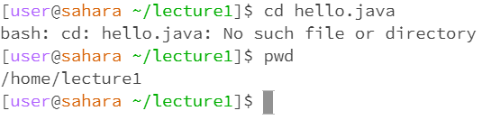

<h3>cd Without Arguments</h3>

 \
For using the cd command without any arguments, nothing is printed and nothing changes in the terminal. That is because the cd command is meant to change the directory and no directory is listed.

<h3>cd With Directory Arguments</h3>

 \
For using the cd command with a directory path argument like lecture1, the terminal now shows that you are working in that directory. That is because the cd command is meant to change the directory to whatever you list as an argument

<h3>cd With File Arguments</h3>

 \
For using the cd command with a file argument like hello.java, the terminal prints "bash: cd: hello.java: No such file or directory". That is because the cd command is meant to change the directory you are working in and a file is not a directory.

 \
For using the ls command without any arguments, a list of files within the current directory is printed. That is because the ls command is meant to print all files in the listed directory and if none is listed as an argument it prints the files in the current directory.

 \
For using the ls command with a directory path argument like messages, a list of files within the listed directory is printed. That is because the ls command is meant to print all files in the listed directory.

 \
For using the ls command with a file argument like hello.java, the name of the file is printed. That is because the ls command is meant to print all accessible files in the listed directory and when a file is listed the only accessible file is the file listed.

 \
For using the cat command without any arguments, nothing is printed and the terminal waits for more keyboard inputs and prints out anything that is typed until ctrl+D is input. That is because the cat command is used to print the contents of what is input and keyboard inputs count.

 \
For using the cat command with a directory path argument like messages, a message saying "cat: messages: Is a directory" is printed. That is because the cat command is used to print the contents of what is input mainly files and in this case, since a directory is used as an argument it just prints the fact that it is a directory.

 \
For using the cat command with a file argument like README, it prints the contents of whats in the file. That is because the cat command is used to print the contents of what is input.
