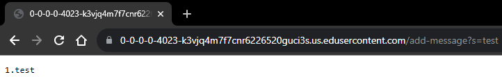
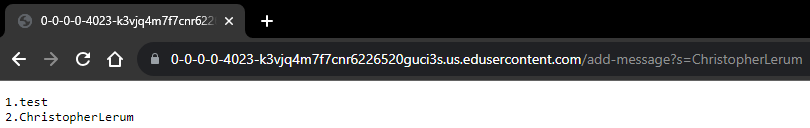
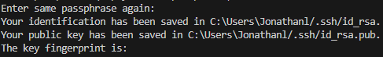
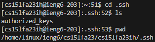
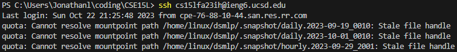

<h1>Lab Report 2 - Servers and SSH Keys -Christopher Lerum</h1>
<h3>Part 1</h3>

    import java.io.IOException;
    import java.net.URI;
    import java.util.ArrayList;
    
    class Handler implements URLHandler {
        // The one bit of state on the server: a number that will be manipulated by
        // various requests.
        int num = 0;
        String words = "";
    
        public String handleRequest(URI url) {
            if (url.getPath().equals("/")) {
                return String.format(words);
            } 
            else {
                if (url.getPath().contains("/add-message")) {
                    String[] parameters = url.getQuery().split("=");
                    if (parameters[0].equals("s")) {
                        num++;
                        words = words + num + '.' + parameters[1] + '\n';
                        return String.format(words);
                    }
                }
                return "404 Not Found!";
            }
        }
    }
    
    class StringServer {
        public static void main(String[] args) throws IOException {
            if(args.length == 0){
                System.out.println("Missing port number! Try any number between 1024 to 49151");
                return;
            }
    
            int port = Integer.parseInt(args[0]);
    
            Server.start(port, new Handler());
        }
    }

For this example, the code used the handleRequest method to process the new url. For this method, it needed a URI argument which came from the url and processed the changes mainly being "/add-message?s=test" at the end of the url. The method uses this part of the url and checks for a "/add-message", a query, and a string at the end in order for the method to work correctly. As a result of this input, the url variable changes to contain the URI argument being "https://0-0-0-0-4023-k3vjq4m7f7cnr6226520guci3s.us.edusercontent.com/add-message?s=test", the num integer variable increments from 0 to 1 as it counts the amount of strings added, and the words string changes as it is now "1.test\n".

For this example, the code used the handleRequest method to process the new url. For this method, it needed a URI argument which came from the url and processed the changes mainly being "/add-message?s=ChristopherLerum" at the end of the url. The method uses this part of the url and checks for a "/add-message", a query, and a string at the end in order for the method to work correctly. As a result of this input, the url variable changes to contain the URI argument being "https://0-0-0-0-4023-k3vjq4m7f7cnr6226520guci3s.us.edusercontent.com/add-message?s=ChristopherLerum", the num integer variable increments from 1 to 2 as it counts the amount of strings added, and the words string changes as it is now "1.test\n2.ChristopherLerum\n".

<h3>Part 2</h3>

*The path to the private key.*

*The path to the public key.*

*The terminal interaction*

<h3>Part 3</h3>
