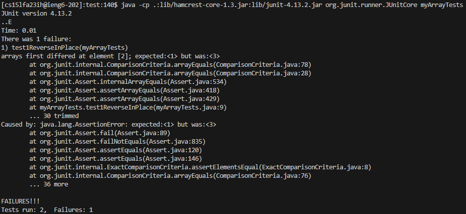

<h1>Lab Report 3 - Bugs and Commands -Christopher Lerum</h1>
<h3>Part 1</h3>

A failure-inducing input for the buggy program, as a JUnit test and any associated code

    import static org.junit.Assert.*;
    import org.junit.*;
  
    public class myArrayTests {
        @Test
        public void test1ReverseInPlace() {C:\Users\Jonathanl\Documents\GitHub\lab3\ArrayExamples.java
            int[] input1 = { 1,2,3 };
            ArrayExamples.reverseInPlace(input1);
            assertArrayEquals(new int[]{ 3,2,1 }, input1);
        }
    }

An input that doesn’t induce a failure, as a JUnit test and any associated code

    public class myArrayTests {
        @Test
        public void test2ReverseInPlace() {
            int[] input1 = { 1 };
            ArrayExamples.reverseInPlace(input1);
            assertArrayEquals(new int[]{ 1 }, input1);
        }
    }
    
The symptom, as the output of running the tests

The bug, as the before-and-after code change required to fix it
before
    
    public class ArrayExamples {

    // Changes the input array to be in reversed order
      static void reverseInPlace(int[] arr) {
        for(int i = 0; i < arr.length; i += 1) {
          arr[i] = arr[arr.length - i - 1];
        }
      }
    }
after

    public class ArrayExamples {

    // Changes the input array to be in reversed order
      static void reverseInPlace(int[] arr) {
        int temp = 0; 
        for(int i = 0; i < arr.length/2; i += 1) {
          temp = arr[i];
          arr[i] = arr[arr.length - i - 1];
          arr[arr.length - i - 1] = temp;
        }
      }
    }
    
In order to fix reverseInPlace, you need to change the for loop to properly swap elements in the array to reverse the order. A temp variable should be used to properly store one of the elements during the swap.

<h3>Part 2 -find</h3>

<h5>-name</h5>

    [cs15lfa23ih@ieng6-201]:docsearch:391$ find -name pmed.0020281.txt
    ./technical/plos/pmed.0020281.txt

The -name option for find allows for looking for files with an exact name. For txt files it gives the relative path from your current directory.

    [cs15lfa23ih@ieng6-201]:docsearch:392$ find -name plos            
    ./technical/plos

When the input is a directory name, it gives you only the directory and no files within.

https://www.computerhope.com/unix/ufind.htm

<h5>-maxdepth</h5>

    [cs15lfa23ih@ieng6-201]:docsearch:393$ find -maxdepth 2 -name '*.java'
    ./DocSearchServer.java
    ./Server.java
    ./TestDocSearch.java  

The -maxdepth option for find allows for looking for files within a set number of directories. for -maxdepth 2 it will give all the files within 2 directories.

    [cs15lfa23ih@ieng6-201]:docsearch:394$ find -maxdepth 1 -iname 'lib'
    ./lib
    [cs15lfa23ih@ieng6-201]:docsearch:395$ cd 
    [cs15lfa23ih@ieng6-201]:~:396$ find -maxdepth 1 -iname 'lib'
    [cs15lfa23ih@ieng6-201]:~:397$ 

When the input is a directory it will give where to find the directories within the given depth.

https://www.computerhope.com/unix/ufind.htm

<h5>-size</h5>

    [cs15lfa23ih@ieng6-201]:docsearch:399$ find -size +100k -name '*.txt'
    ./technical/911report/chapter-1.txt
    ./technical/911report/chapter-12.txt  
    ./technical/911report/chapter-13.2.txt
    ./technical/911report/chapter-13.3.txt
    ./technical/911report/chapter-13.4.txt
    ./technical/911report/chapter-13.5.txt
    ./technical/911report/chapter-3.txt   
    ./technical/911report/chapter-6.txt
    ./technical/911report/chapter-7.txt
    ./technical/911report/chapter-9.txt
    ./technical/biomed/1471-2105-3-2.txt
    ./technical/government/About_LSC/State_Planning_Report.txt
    ./technical/government/About_LSC/commission_report.txt
    ./technical/government/Env_Prot_Agen/bill.txt
    ./technical/government/Env_Prot_Agen/ctm4-10.txt
    ./technical/government/Env_Prot_Agen/multi102902.txt
    ./technical/government/Env_Prot_Agen/tech_adden.txt
    ./technical/government/Gen_Account_Office/GovernmentAuditingStandards_yb2002ed.txt
    ./technical/government/Gen_Account_Office/May1998_ai98068.txt
    ./technical/government/Gen_Account_Office/Sept27-2002_d02966.txt
    ./technical/government/Gen_Account_Office/Statements_Feb28-1997_volume.txt
    ./technical/government/Gen_Account_Office/ai9868.txt
    ./technical/government/Gen_Account_Office/d01376g.txt
    ./technical/government/Gen_Account_Office/d01591sp.txt
    ./technical/government/Gen_Account_Office/d0269g.txt
    ./technical/government/Gen_Account_Office/d02701.txt
    ./technical/government/Gen_Account_Office/gg96118.txt
    ./technical/government/Gen_Account_Office/im814.txt
    ./technical/government/Gen_Account_Office/pe1019.txt

The -size option for find allows for looking for files that are a given size or greater. When a txt file is input, it will output only txt files bigger than the given size.

    [cs15lfa23ih@ieng6-201]:docsearch:400$ find -size +100k -iname 'government*'
    ./technical/government/Gen_Account_Office/GovernmentAuditingStandards_yb2002ed.txt

When the input is a directory name, it will give the files within that directory that is the size or bigger.

https://www.computerhope.com/unix/ufind.htm

<h5>-iname</h5>
    
    [cs15lfa23ih@ieng6-201]:docsearch:403$ find -iname 'Government*'
    ./technical/government
    ./technical/government/Gen_Account_Office/GovernmentAuditingStandards_yb2002ed.txt

The -iname option for find allows for looking for files that have the input anywhere in the name of the file. It will output both directories and files.

    [cs15lfa23ih@ieng6-201]:docsearch:402$ find -iname 'government'
    ./technical/government

When the input is a directory name, it will look for all directories with that in its name.
    
https://www.computerhope.com/unix/ufind.htm
