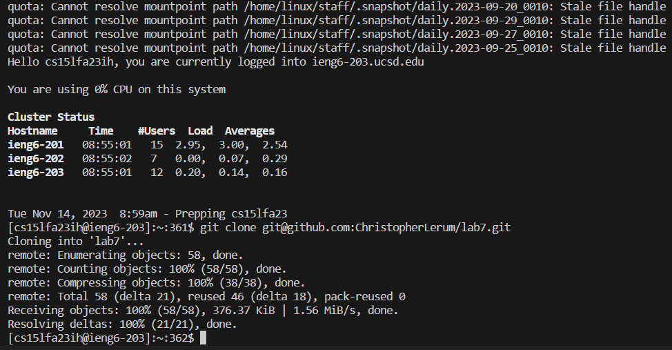
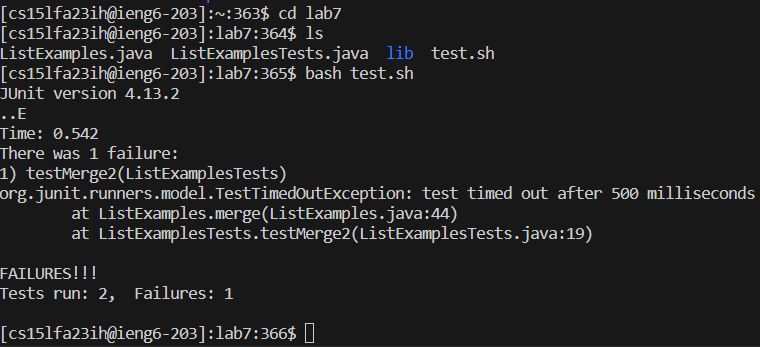
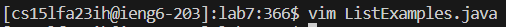
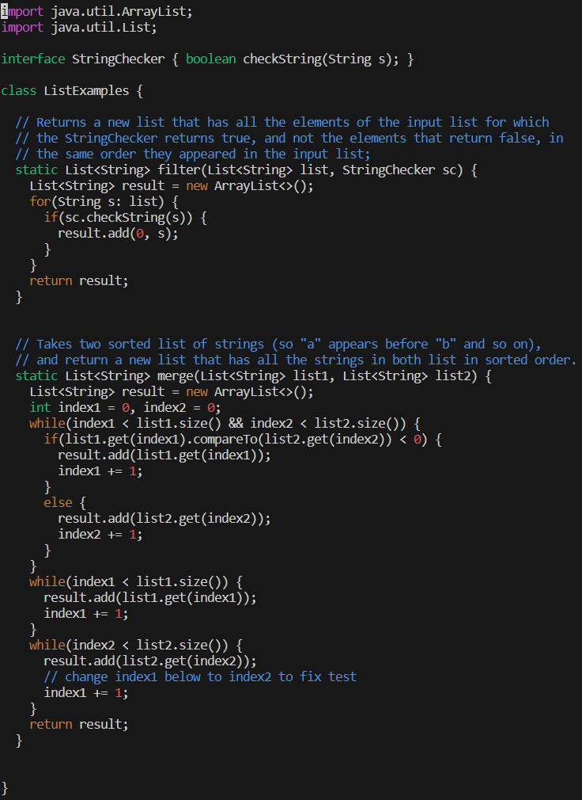
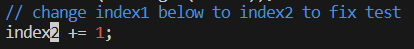
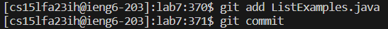
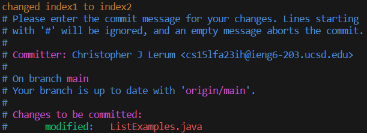
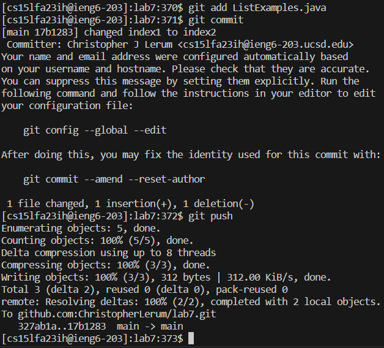

<h1>Lab Report 4 - Vim -Christopher Lerum</h1>
<h3>Log into ieng6</h3>

Commands used: *ssh cs15lfa23ih@ieng6.ucsd.edu* is typed out/copied into the terminal, `*<enter>*`

<h3>Clone your fork of the repository from your Github account (using the SSH URL)</h3>

Commands used: *git clone* is typed and then *git@github.com:ChristopherLerum/lab7.git* is pasted into the command line using right click, *<enter>*

<h3>Run the tests, demonstrating that they fail</h3>

Commands used: *cd lab7* to enter the correct directory, *ls* to confirm the directory contents, *bash test.sh* to run the tests, *<enter>*

<h3>Edit the code file to fix the failing test</h3>

Keys typed: *vim L* which is the beginning of the vim editor command, *<tab>* autofills *ListExamples*, *.* which continues the file name, *<tab>* autofills *java* to finish the file name, *<enter>*

<h5>before edits</h5>

<h5>the line edited</h5>

Keys typed: *j* 43 times to get down to the line with the error, *l* 11 times to get to the 1, *x* to delete the 1, *i* to enter insert, *2* to change the variable to *index2*, *<esc>* to return to normal mode, *:wq* to save and exit the vim editor, *<enter>*

<h3>Run the tests, demonstrating that they now succeed</h3>

Keys typed:*<up>*, *<up>*, *<enter>* the *bash test.sh* command which was 2 up in the command history, *<enter>*

<h3>Commit and push the resulting change to your Github account (you can pick any commit message!)</h3>

Keys typed: *git add L* to start the command, *<tab>* autofills *ListExamples.java*, *<enter>*, *git commit*, *<enter>* will start commiting the changes

Keys typed: *i* to enter insert mode, *changed index1 to index2* which is the commit message, *<esc>* to return to normal mode, *:wq* to save and exit the vim editor, *<enter>*

Keys typed: *git push* to push the commits, *<enter>*
