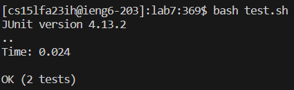

<h1>Lab Report 4 - Vim -Christopher Lerum</h1>
<h3>Log into ieng6</h3>

Commands used: <mark>*ssh cs15lfa23ih@ieng6.ucsd.edu*</mark> is typed out/copied into the terminal, <mark>*<enter>*</mark>

<h3>Clone your fork of the repository from your Github account (using the SSH URL)</h3>

Commands used: <mark>*git clone*</mark> is typed and then *git@github.com:ChristopherLerum/lab7.git* is pasted into the command line using <mark>right click</mark>, <mark>*<enter>*</mark>

<h3>Run the tests, demonstrating that they fail</h3>

Commands used: <mark>*cd lab7*</mark> to enter the correct directory, <mark>*ls*</mark> to confirm the directory contents, <mark>*bash test.sh*</mark> to run the tests, <mark>*<enter>*</mark>

<h3>Edit the code file to fix the failing test</h3>

Keys typed: <mark>*vim L*</mark> which is the beginning of the vim editor command, <mark>*<tab>*</mark> autofills <mark>*ListExamples*</mark>, <mark>*.*</mark> which continues the file name, <mark>*<tab>*</mark> autofills <mark>*java*</mark> to finish the file name, <mark>*<enter>*</mark>

<h5>before edits</h5>

<h5>the line edited</h5>

Keys typed: <mark>*j*</mark> 43 times to get down to the line with the error, <mark>*l*</mark> 11 times to get to the 1, <mark>*x*</mark> to delete the 1, <mark>*i*</mark> to enter insert, <mark>*2*</mark> to change the variable to *index2*, <mark>*<esc>*</mark> to return to normal mode, <mark>*:wq*</mark> to save and exit the vim editor, <mark>*<enter>*</mark>

<h3>Run the tests, demonstrating that they now succeed</h3>

Keys typed:<mark>*<up>*</mark>, <mark>*<up>*</mark>, <mark>*<enter>*</mark> the <mark>*bash test.sh*</mark> command which was 2 up in the command history, <mark>*<enter>*</mark>

<h3>Commit and push the resulting change to your Github account (you can pick any commit message!)</h3>

Keys typed: <mark>*git add L*</mark> to start the command, <mark>*<tab>*</mark> autofills <mark>*ListExamples.java*</mark>, <mark>*<enter>*</mark>, <mark>*git commit*</mark>, <mark>*<enter>*</mark> will start commiting the changes

Keys typed: <mark>*i*</mark> to enter insert mode, <mark>*changed index1 to index2*</mark> which is the commit message, <mark>*<esc>*</mark> to return to normal mode, <mark>*:wq*</mark> to save and exit the vim editor, <mark>*<enter>*</mark>

Keys typed: <mark>*git push*</mark> to push the commits, <mark>*<enter>*</mark>
