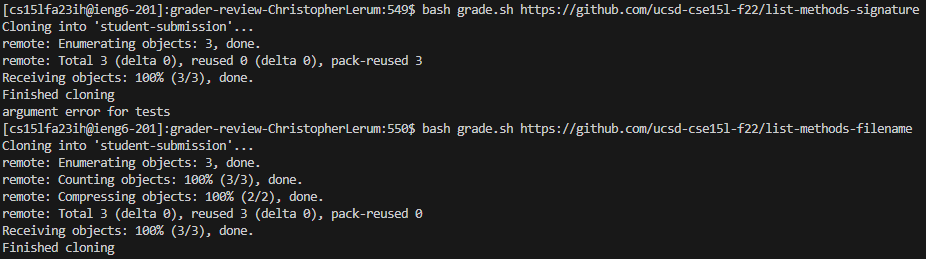
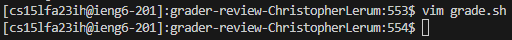
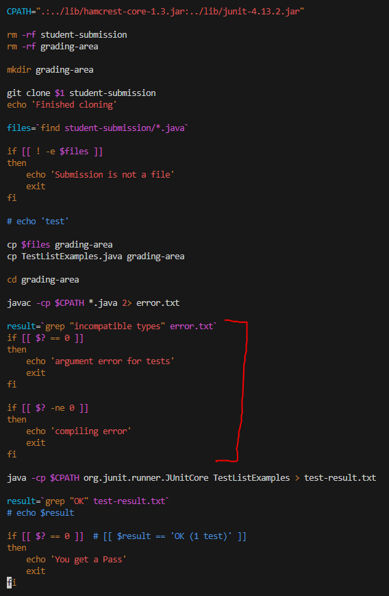
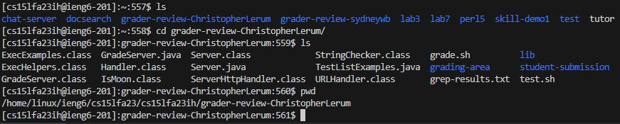

<h1>Lab Report 5 - Putting it All Together -Christopher Lerum</h1>
<h2> Part 1 – Debugging Scenario </h2>
<h2>The original post from a student with a screenshot showing a symptom and a description of a guess at the bug/some sense of what the failure-inducing input is</h2>

Hello, while working on lab 6 and the grade script, I was able to get the code to work for the submissions beforehand and now I finally got the code to work for the list-methods-signature submission by checking for incompatible types. However, now it does not say that there are compiling errors for the other errors. Any advice?

<h2>A response from a TA asking a leading question or suggesting a command to try</h2>

Have you tried using vim and checking the script if conditional statements or the order of commands in the bash script to see if the script may be ending early on accident or running commands incorrectly. 

<h2>Another screenshot/terminal output showing what information the student got from trying that, and a clear description of what the bug is</h2>

After using vim to check the (incomplete) code I was working on, the bug that is there is that by adding in the incompatible types error check, the code automatically exits before checking for anything else. It also interrupts the compiling error conditional and prevents it from running for any other submission. 

<h2>At the end, all the information needed about the setup including:</h2>
<h3>The file & directory structure needed</h3>

<h3>The contents of each file before fixing the bug, in this case the grade.sh file</h3>

<h3>The full command line (or lines) you ran to trigger the bug</h3>

<h3>A description of what to edit to fix the bug</h3>

To fix the issue you need to rearrange the conditional statements. First check if there was any compiling errors and then check for specific types of errors. The new if statements after javac should look list this.

    javac -cp $CPATH *.java 2> error.txt
    if [[ $? -ne 0 ]]
    then
        echo 'compiling error'
        result=`grep "incompatible types" error.txt`
        if [[ $? == 0 ]]
        then
            echo 'argument error for tests'
        fi
        exit
    fi

<h2>Part 2 – Reflection</h2>

I learned a lot about using command line arguments, using Linux and bash and other commands, how to move through directories and files, and how to use JDB and VIM. I had no idea how to use any of this until now and the closest I was to this was coding in assembly. it was a lot of fun and I really liked the class.
